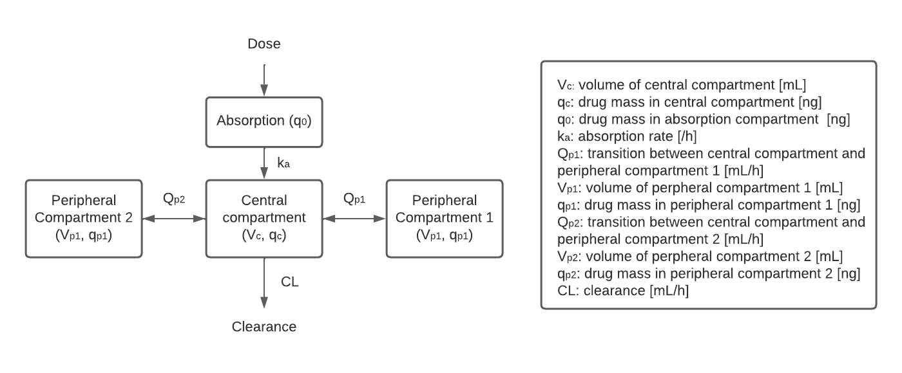

# Pharmodel
Software engineering miniproject \
Group 1: Arun Raja, Henriette Capel, Nathan Schofield, Jiayuan Zhu

## :pill: Pharmokinetic Modelling
This pharmokinetic model describes the concentration of a drug in a patient. This model includes the delivery, diffusion, and clearance of the drug in the patient. The patient will be modelled as a central compartment into which the drug is administered and from which it is excreted. One or two peripheral compartements can be added by the user. The drug can be distributed to these peripheral compartments and from these compartments back to the central compartment. The dynamics of the drug are modelled by zeroth-order and first-order rate equations. 

## :rocket: Installing Pharmodel

## :running: Using Pharmodel
### Input Parameters
The model takes a csv file and the parameters as input parameters: 
- The csv file describes the dosing protocol including the start of a certain dose (tstart, in [h]), the end of the dosing period (tend, in [h]), the drug mass (dose, in [ng]), and a binary value indicating if the dose is given instantaneous at a certain time point or constant over a certain time period. Example protocols including edge cases are provided in the "test_data" folder. 
- the folowing parameters can be specified by the user:\
 **absorb**: binary value indicating intravenous bolus dosing (0) or subcutaneous dosing (1)\
 **comp**: integer indicating the number of compartment. The three possibilities are only the central compartment (0), an additional peripheral compartment (1), or an second additional peripheral compartment (2)\
 **$V_c$**: int or float  
 **$CL$**: int/float  
 **$Q_{p1}$**: int/float  
 **$V_{p1}$**: int/float   
 **$Q_{p2}$**: int/float   
 **$V_{p2}$**: int/float   
 **$k_a$**: int/float  
 Examples parameter sets are stored in a list in the file "test_data/test_parameters.txt". 
 \
 
 **NOTE**: parameters should be provided by the user in the order as described above. So, in case of absorb=1 and comp=1, the user should provide a int/float for the parameters $Q_{p2}$ and $V_{p2}$ in order to set $k_a$.
 
### Running the model
The Pharmodel library consist of four classes. The **Protocol** class enable the user to read in a dosising protocol. The **Model** class stores the parameters. The **Solution** class solves the ODEs based on the desired pharmokinetic model, which can be visualised by the **Visualisation** class.  
\
This is an example code to run the model:

<pre><code>dose_rec = Protocol("test_data/test_dosis_continuous.csv")
dose_df = dose_rec.read_doses()
model_params1 = Model(absorb = 1, comp = 0, V_c = 1.0 , CL = .1, Q_p1 = 1.0, V_p1 = 0.1, Q_p2 = 1.0, V_p2 = 0.1, k_a = 1.0)
model_params2 = Model(absorb = 1, comp = 0, V_c = 1.0 , CL = .1, Q_p1 = 2, V_p1 = 0.1, Q_p2 = 1.0, V_p2 = 0.1, k_a = 1.0)
solution_model1 = Solution(dose_df, model_params1)
solution_model2 = Solution(dose_df, model_params2)
test_case = visualisation(solution_model1, solution_model2)
print(test_case.plot_figure())
</code></pre>

The output:

## :page_facing_up: Licence 
Pharmodel is fully open source. For more information about the license, see [LICENSE](LICENSE).

